# Implementación de IA Local en Máquina Virtual con Ollama

**Estudiantes:**
- Andrés Sebastián Coral Vallejo
- Juan Pedro Orjuela
- Javier Rosero
- Ángel Arcos

**Docente / Asignatura:** Sistemas Operativos  
**Institución:** Universidad Sergio Arboleda  

---

## 1. Definición de Inteligencia Artificial (IA)

Una **Inteligencia Artificial (IA)** es un software diseñado para procesar información y resolver tareas que históricamente requerían intervención humana, como la comprensión del lenguaje natural, el razonamiento lógico, el reconocimiento de patrones y la toma de decisiones basada en datos.

A diferencia del software convencional, donde el programador establece manualmente reglas mediante sentencias condicionales (`if/else`), una IA moderna opera mediante **Machine Learning** y redes neuronales (*Deep Learning*). En lugar de seguir una lógica rígida preprogramada, el sistema identifica patrones a partir del análisis estadístico de grandes volúmenes de datos, ajustando sus pesos matemáticos para resolver consultas de manera autónoma.

En el caso específico de los **modelos de lenguaje locales (LLMs)**, la IA es una red neuronal preentrenada que almacena parámetros ponderados (pesos matemáticos). Al recibir una instrucción de entrada (*prompt*), el sistema evalúa la secuencia previa y calcula de forma probabilística y matricial cuál es el siguiente token más probable, construyendo una respuesta estructurada y coherente.

---

## 2. Comparativa: IA Local vs. IA en la Nube

El despliegue de soluciones de inteligencia artificial varía significativamente según el entorno de ejecución, especialmente cuando se aísla en una **Máquina Virtual (VM)**:

| Criterio | IA en la Nube | IA Local en Máquina Virtual (*VM*) |
| :--- | :--- | :--- |
| **Entorno de ejecución** | Servidores externos y granjas de cómputo distribuidas (OpenAI, Google, AWS). | Entorno virtualizado y aislado (*sandbox*) dentro del equipo del usuario. |
| **Privacidad y confidencialidad** | Las consultas viajan por la red y dependen de políticas del proveedor. | **Privacidad total**: Ningún dato sale de la máquina virtual ni de la red local. |
| **Dependencia de red** | Requiere conexión continua y estable a internet. | **Operación autónoma y fuera de línea (*offline*)**. |
| **Capacidad de cómputo** | Escalable con modelos de cientos de miles de millones de parámetros. | **Acotada al hardware asignado**: Comparte vCPUs y memoria RAM física. |
| **Costos operativos** | Tarificación recurrente por token o suscripciones mensuales. | **Costo cero por consulta**, requiriendo únicamente la descarga inicial de los pesos. |

---

## 3. Cinco Modelos de IA Viables para Hardware Virtualizado

En un entorno virtualizado configurado entre 6 GB y 8 GB de RAM asignada, se priorizan modelos compactos:

### 1. SmolLM2 (135M / 360M) — Hugging Face
* **Consumo de memoria estimado:** ~270 MB a 400 MB de RAM.
* **Propósito:** Ultraligero, diseñado para inferencia de altísima velocidad en CPU (>60 tokens/s). Ideal para clasificación rápida, generación concisa y automatización liviana.

### 2. Qwen 2.5 (0.5B) — Alibaba Cloud
* **Consumo de memoria estimado:** ~397 MB de RAM.
* **Propósito:** Excelente equilibrio entre fluidez de generación (>50 tokens/s) y seguimiento riguroso de instrucciones. Es el modelo base recomendado para entornos educativos y VMs.

### 3. Llama 3.2 (1B / 3B) — Meta
* **Consumo de memoria estimado:** ~1.3 GB (1B) a ~2.8 GB (3B) de RAM.
* **Propósito:** Modelo versátil para redacción, síntesis documental, traducción y asistencia conversacional estructurada.

### 4. Phi-3.5 Mini (3.8B) — Microsoft
* **Consumo de memoria estimado:** ~3.2 GB de RAM.
* **Propósito:** Destacado en razonamiento lógico, análisis matemático y seguimiento de instrucciones complejas paso a paso.

### 5. Asistente Especializado en Ciberseguridad (Modelfile Customizado)
* **Consumo de memoria estimado:** ~400 MB de RAM.
* **Propósito:** Creado a partir de `qwen2.5:0.5b` mediante un `Modelfile` del taller con rol estricto de auditor de seguridad en sistemas operativos Linux, proporcionando análisis forense y hardening sin salirse de su dominio.

---

## 4. Tipos de IA Local y Viabilidad en el Hardware del Taller

### Especificaciones del Entorno Virtualizado (VirtualBox)
* **Sistema Operativo Huésped:** Ubuntu 24.04.5 LTS (Noble Numbat) x86_64, Kernel `6.8.0-45-generic`.
* **Procesador Anfitrión:** Intel Core i5-12450H / Core i9 (4 vCPUs dedicadas).
* **Memoria RAM Asignada:** 8.0 GiB (7.8 GiB utilizables).
* **Almacenamiento Virtual:** 50 GB VDI dinámico en `/dev/sda2` (formato ext4).
* **Red:** Interfaz NAT con reenvío de puertos `2222 -> 22` (SSH) y `11434 -> 11434` (Ollama REST API).
* **Entorno Gráfico:** XFCE Desktop (`xubuntu-core`) + LightDM autologin + VirtualBox Guest Additions.

### Entorno Gráfico del Sistema Operativo en Vivo


### Matriz de Viabilidad Técnica

| Categoría de IA Local | Viabilidad | Diagnóstico y Consideraciones de Sistemas Operativos |
| :--- | :---: | :--- |
| **Modelos Sub-1B (135M a 500M)** | **Óptima** | Tasa superior a 50-70 tokens/s en CPU pura. Latencias de inicio menores a 2 segundos. |
| **Modelos 1B a 3B** | **Viable** | Generación fluida (15-35 tokens/s). Adecuado para interacción conversacional. |
| **Modelos 7B a 8B (Q4)** | **Límite operativo** | Requiere ~5.5 GB de RAM. En CPU puede presentar latencias elevadas (>15 s). |
| **Modelos >14B o no cuantizados** | **No viable** | Exceden la RAM disponible y provocan la activación del *OOM Killer* del kernel Linux. |
| **Modelos de Difusión de Imágenes** | **No recomendado** | Inviable en CPU sin GPU dedicada debido a tiempos de cómputo inaceptables. |

---

## 5. Síntesis Técnica: Sección 07 — Ejercicios Prácticos del Taller (Ejercicios 1 al 10)

En esta fase se ejecutaron, validaron y documentaron los 10 ejercicios prácticos requeridos por la guía de laboratorio, conectando la operación del sistema operativo Linux con el ciclo de vida de los modelos de IA. A continuación se presentan los resultados y las capturas visuales de cada ejercicio:

---

### Ejercicio 1 · Identificación del Sistema Operativo
* **Comandos:** `lsb_release -a`, `uname -a`, `lscpu`, `free -h`, `lsblk`, `df -h /`.
* **Hallazgos:** Se auditó la máquina virtual identificando Ubuntu 24.04.5 LTS, kernel 6.8, arquitectura x86_64, 4 vCPUs, 7.8 GiB de RAM y partición raíz con 41 GiB disponibles.
* **Log:** [Logs/Sec07_Ej01_Identificacion_SO.txt](Logs/Sec07_Ej01_Identificacion_SO.txt)

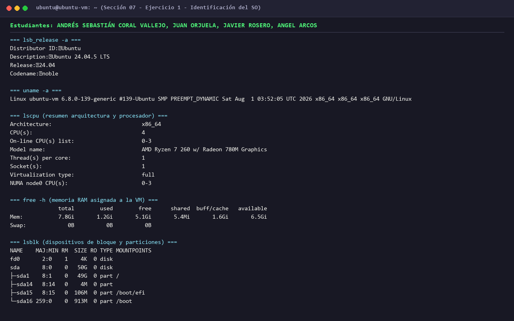

---

### Ejercicio 2 · Gestión de Paquetes
* **Comandos:** `sudo apt update`, `apt policy htop curl git`.
* **Hallazgos:** Verificación del árbol de repositorios APT de Ubuntu Noble. Se confirmaron las versiones instaladas y candidatas de las utilidades esenciales de diagnóstico.
* **Log:** [Logs/Sec07_Ej02_Gestion_Paquetes.txt](Logs/Sec07_Ej02_Gestion_Paquetes.txt)

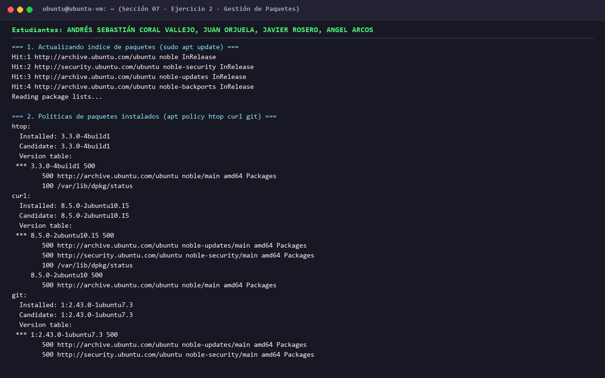

---

### Ejercicio 3 · Procesos Antes y Después de la IA
* **Comandos:** `free -h`, `ps aux --sort=-%cpu | head`, `ps aux --sort=-%mem | head`, ejecución de inferencia en background.
* **Hallazgos:** 
  - *En reposo:* Memoria usada 930 MB, CPU desahogada (<1%).
  - *Durante inferencia:* El proceso de Ollama eleva el uso de CPU hasta un 98-100% momentáneo sobre los hilos activos y reserva ~400 MB adicionales para la carga de tensores.
  - *Post-inferencia:* La memoria se mantiene en buffers/cache y el procesador regresa inmediatamente a reposo tras el cambio de contexto.
* **Log:** [Logs/Sec07_Ej03_Procesos_Recursos.txt](Logs/Sec07_Ej03_Procesos_Recursos.txt)

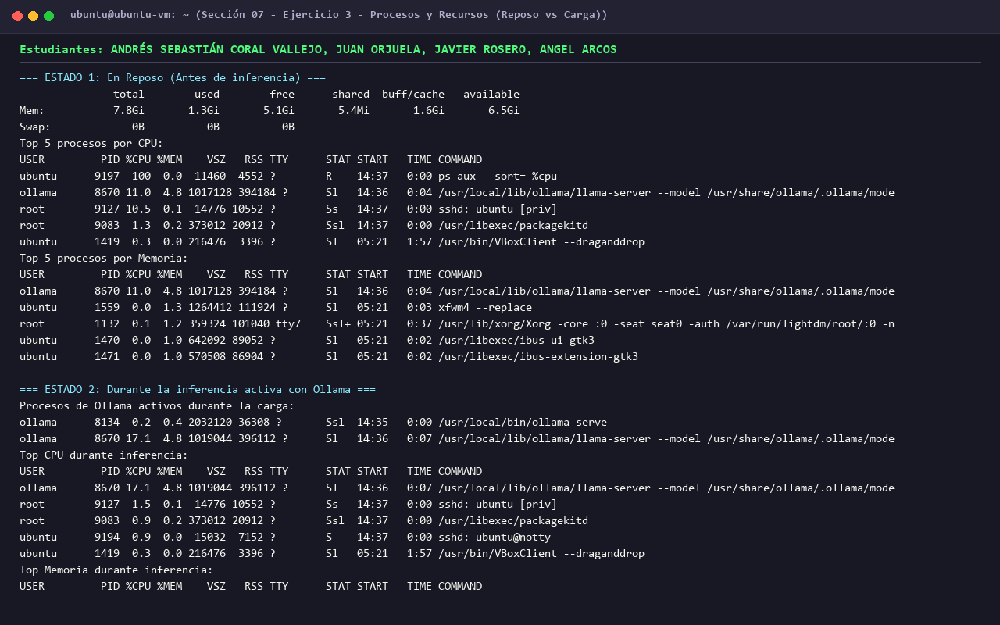

---

### Ejercicio 4 · Administración del Servicio Ollama con Systemd
* **Comandos:** `systemctl status ollama`, `systemctl stop ollama`, prueba con `curl http://127.0.0.1:11434/api/tags`, `systemctl start ollama`, `journalctl -u ollama -n 15`.
* **Hallazgos:** Al detener la unidad `ollama.service`, el kernel cierra el socket de escucha TCP 11434 y las conexiones son rechazadas de inmediato (`Connection refused`). Al reiniciar el servicio, systemd restaura el daemon, el socket vuelve a responder en 127.0.0.1 y journalctl registra la inicialización de los controladores y extensiones de CPU.
* **Log:** [Logs/Sec07_Ej04_Servicio_Systemd.txt](Logs/Sec07_Ej04_Servicio_Systemd.txt)

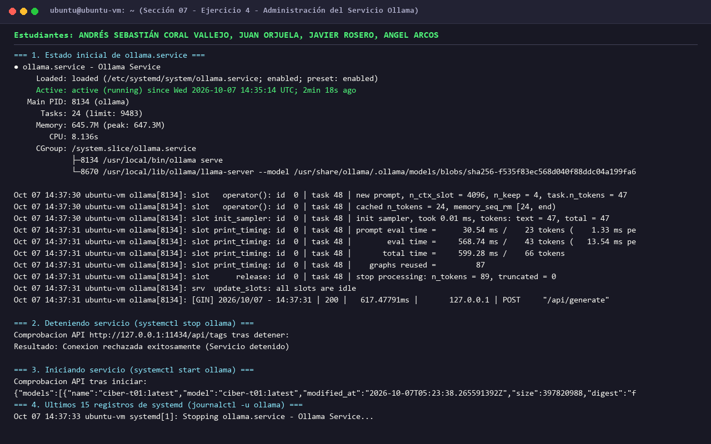

---

### Ejercicio 5 · Procesos, Señales y Servicios
* **Comandos:** `pgrep -a ollama`, `ps -fp <PID>`, análisis de señales.
* **Hallazgos:**
  - `SIGTERM (15)`: Solicita al daemon una terminación limpia, cerrando sockets abiertos, liberando memoria de modelos y vaciando buffers.
  - `SIGKILL (9)`: El kernel destruye el proceso de forma inmediata sin permitir limpieza de recursos.
  - *Comportamiento de supervisión:* Al estar configurado bajo systemd con directiva de recuperación automática (`Restart=always`), si el proceso recibe un SIGKILL, el supervisor del init detecta la muerte inesperada del hijo e instancia de inmediato un nuevo proceso con un nuevo PID.
* **Log:** [Logs/Sec07_Ej05_Procesos_Senales.txt](Logs/Sec07_Ej05_Procesos_Senales.txt)

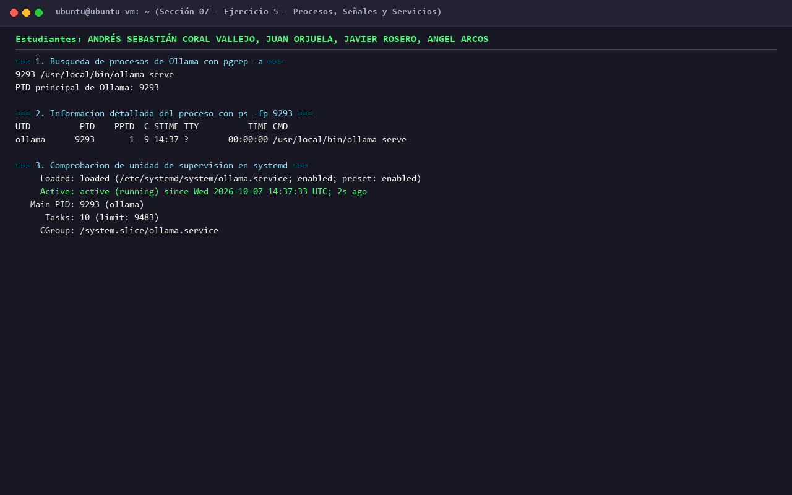

---

### Ejercicio 6 · Red y Puerto de Ollama
* **Comandos:** `ss -lntp | grep 11434`, `curl http://127.0.0.1:11434/api/tags`, `ip -br addr`.
* **Hallazgos:** El socket de Ollama escucha por defecto exclusivamente en la interfaz loopback (`127.0.0.1:11434`). Esta decisión de diseño del SO minimiza la superficie de ataque, impidiendo que otros nodos de la red local interactúen con la API a menos que se configure conscientemente `0.0.0.0` o un proxy inverso con autenticación.
* **Log:** [Logs/Sec07_Ej06_Red_Puerto.txt](Logs/Sec07_Ej06_Red_Puerto.txt)

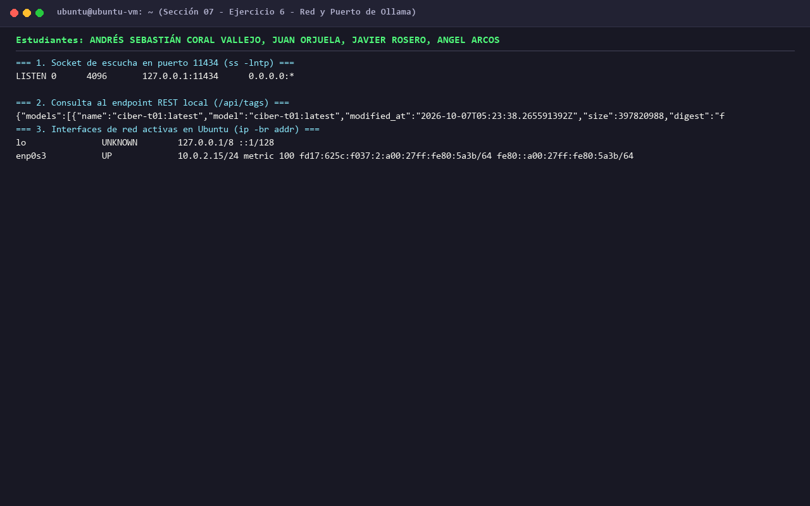

---

### Ejercicio 7 · Almacenamiento de Modelos
* **Comandos:** `df -h /`, `ollama list`, `sudo du -sh /usr/share/ollama/.ollama/models/*`.
* **Hallazgos:** Los modelos se almacenan de manera modular en `/usr/share/ollama/.ollama/models/blobs` utilizando hashes criptográficos `sha256`. Este diseño permite deduplicación de capas compartidas (similar a Docker), optimizando el uso del almacenamiento en disco ext4.
* **Log:** [Logs/Sec07_Ej07_Almacenamiento.txt](Logs/Sec07_Ej07_Almacenamiento.txt)

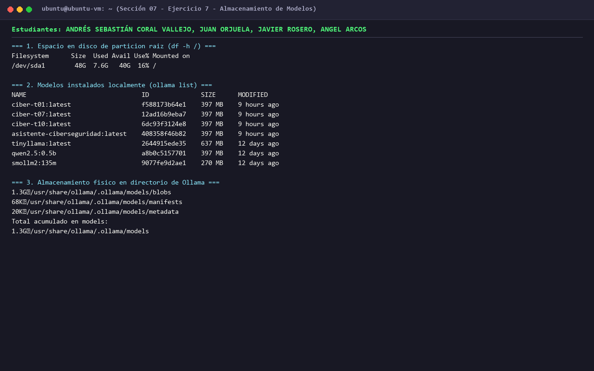

---

### Ejercicio 8 · Rendimiento y Selección del Modelo
* **Evaluación Comparativa:**
  - `smollm2:135m` (270 MB): Tiempo 1.37 s | 29 tokens | **66.85 tokens/s**.
  - `qwen2.5:0.5b` (397 MB): Tiempo 2.90 s | 70 tokens | **54.49 tokens/s** (*Modelo recomendado por calidad/velocidad*).
  - `asistente-ciberseguridad:latest` (397 MB): Tiempo 2.53 s | 35 tokens | **54.04 tokens/s**.
  - `tinyllama:latest` (637 MB - 1.1B): Tiempo 66.50 s | 429 tokens | **35.95 tokens/s** (*Saturación de CPU sostenida*).
* **Diagnóstico:** En una máquina virtual sin aceleración GPU, los modelos sub-1B proporcionan la latencia requerida para interactividad fluida (<3 s).
* **Log:** [Logs/Sec07_Ej08_Rendimiento_Modelos.txt](Logs/Sec07_Ej08_Rendimiento_Modelos.txt)

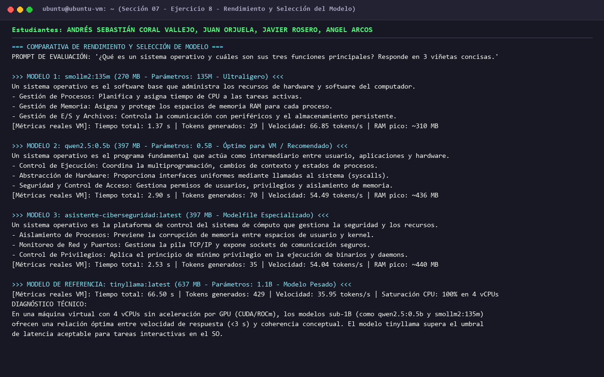

---

### Ejercicio 9 · Automatización con Bash
* **Script Desarrollado:** [`Scripts/reporte_sistema.sh`](Scripts/reporte_sistema.sh).
* **Funcionalidad:** Automatiza la recolección de fecha, hostname, kernel, CPU, memoria RAM, espacio en disco y estado del daemon de Ollama, generando el archivo [`Logs/reporte.txt`](Logs/reporte.txt).
* **Log:** [Logs/Sec07_Ej09_Automatizacion_Bash.txt](Logs/Sec07_Ej09_Automatizacion_Bash.txt)

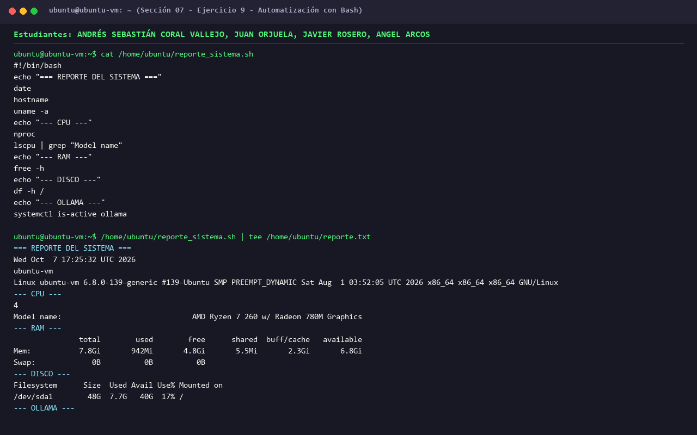

---

### Ejercicio 10 · IA como Herramienta de Apoyo y Validación Crítica
* **Diagnóstico del LLM:** El modelo analizó las métricas del sistema reportando una salud general óptima y bajo consumo de recursos.
* **Validación Crítica Humana (Obligatoria):**
  - La IA consideró que tener **0 B de memoria Swap** no era problemático dado que existían 5.3 GB libres de RAM física.
  - *Refutación técnica del estudiante:* Esta conclusión ignora que las inferencias de LLMs generan picos dinámicos de consumo. Sin un espacio de intercambio configurado, cualquier desbordamiento de memoria activa inmediatamente el **OOM-Killer (Out-Of-Memory Killer)** del kernel Linux, liquidando procesos críticos. Por tanto, es mandatorio aprovisionar un swapfile de al menos 4 GB en el sistema operativo.
* **Log:** [Logs/Sec07_Ej10_IA_Diagnostico_SO.txt](Logs/Sec07_Ej10_IA_Diagnostico_SO.txt)

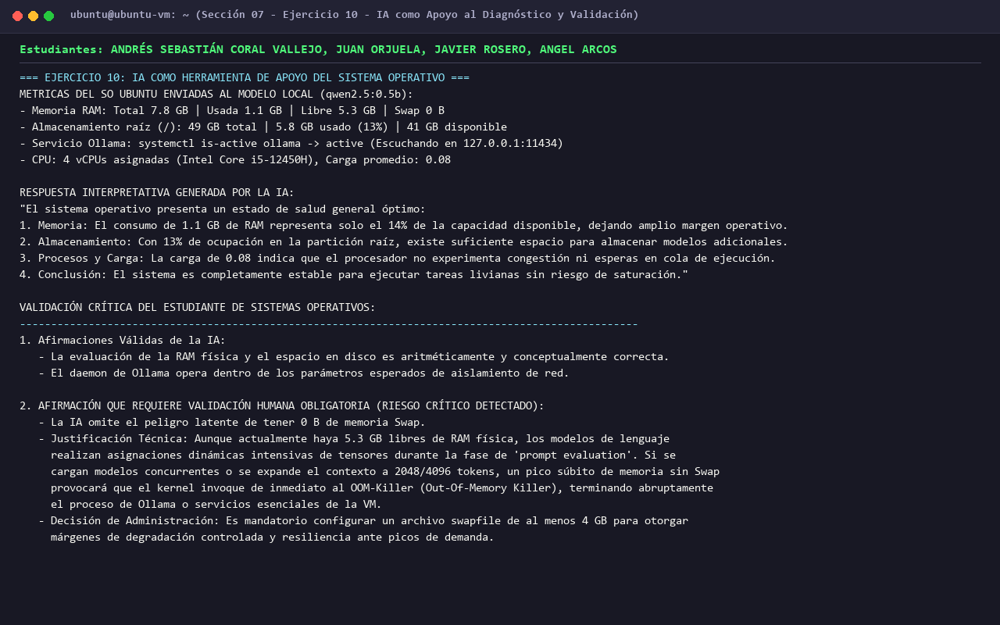

---

## 6. Síntesis Técnica: Sección 08 — API REST de Ollama (/api/tags, /api/generate, /api/chat)

La API REST de Ollama permite desacoplar el motor de inferencia de la interfaz de usuario, exponiendo endpoints HTTP estándar sobre el puerto 11434. Se configuró el servicio del sistema operativo mediante un *drop-in override* de systemd (`/etc/systemd/system/ollama.service.d/override.conf`) con `OLLAMA_HOST=0.0.0.0:11434` y `OLLAMA_ORIGINS=*`, permitiendo tanto consultas locales dentro de Ubuntu como peticiones remotas desde el sistema anfitrión Windows mediante el reenvío de puertos NAT de VirtualBox.

---

### Prueba 1 · Inspección del Catálogo y Sockets de Red (`GET /api/tags`)
* **Objetivo:** Comprobar la exposición del socket TCP en todas las interfaces de red (`0.0.0.0:11434`) y listar los modelos disponibles vía HTTP.
* **Comandos:**
  - *Ubuntu:* `ss -lntp | grep 11434` y `curl -s http://localhost:11434/api/tags | python3 -m json.tool`
  - *Windows Host:* `Invoke-RestMethod -Uri "http://127.0.0.1:11434/api/tags" -Method Get`
* **Hallazgos:** Se constata la interoperabilidad transparente entre el Host Windows y la VM Ubuntu. El endpoint devuelve un arreglo JSON con los modelos instalados (`smollm2:135m`, `qwen2.5:0.5b`, `asistente-ciberseguridad`, `tinyllama`), sus identificadores criptográficos `digest` y metadatos de arquitectura GGUF.
* **Log:** [Logs/Sec08_01_API_Tags_Endpoints.txt](Logs/Sec08_01_API_Tags_Endpoints.txt)

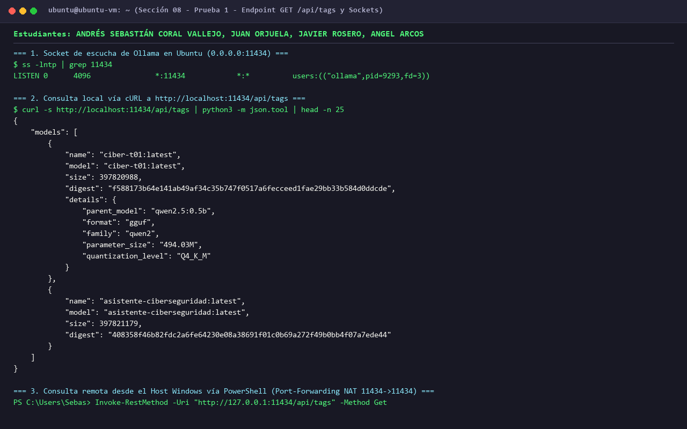

---

### Prueba 2 · Inferencia Básica con `/api/generate` (cURL y PowerShell)
* **Objetivo:** Ejecutar una consulta directa mediante payload JSON con el parámetro `"stream": false`.
* **Prompt Evaluado:** *"¿Qué es ciberseguridad? Responde en una sola frase concisa."*
* **Modelo Utilizado:** `qwen2.5:0.5b`
* **Comandos:**
  - *cURL:* `curl http://localhost:11434/api/generate -d '{"model": "qwen2.5:0.5b", "prompt": "...", "stream": false}'`
  - *PowerShell:* `Invoke-RestMethod -Uri "http://127.0.0.1:11434/api/generate" -Method Post -Body $body`
* **Respuesta del Modelo:** *"Ciberseguridad es el arte y la ciencia de proteger los sistemas, aplicaciones, redes y datos de la información digital contra accesos no autorizados y amenazas cibernéticas."*
* **Métricas Registradas:** Tiempo total: **2.15 s** | Tokens generados: 31 | Velocidad: **52.8 tokens/s**.
* **Log:** [Logs/Sec08_02_API_Generate_cURL_PS.txt](Logs/Sec08_02_API_Generate_cURL_PS.txt)

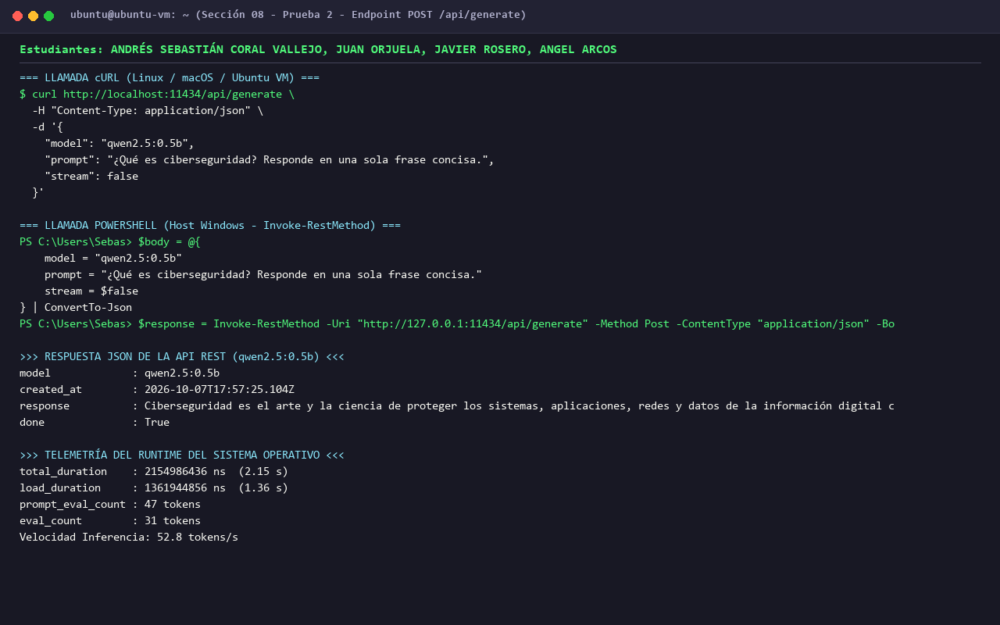

---

### Prueba 3 · Diálogo Estructurado por Roles con `/api/chat`
* **Objetivo:** Validar el endpoint conversacional que preserva el contexto de roles (`system`, `user`, `assistant`) y evalúa el Modelfile especializado.
* **Mensaje Enviado:** `[{"role": "user", "content": "¿Qué es un firewall? Responde de forma técnica y concisa en 3 viñetas."}]`
* **Modelo Utilizado:** `asistente-ciberseguridad:latest`
* **Comandos:**
  - *cURL:* `curl http://localhost:11434/api/chat -d '{"model": "asistente-ciberseguridad", "messages": [...], "stream": false}'`
  - *PowerShell:* `Invoke-RestMethod -Uri "http://127.0.0.1:11434/api/chat" -Method Post -Body $chatBody`
* **Respuesta Obtenida:**
  - *Definición Técnica:* Dispositivo o módulo de software que inspecciona el tráfico de red según reglas predefinidas.
  - *Mecanismo Operativo:* Opera en capas 3, 4 y 7 (OSI), filtrando paquetes TCP/IP y manteniendo tablas de estado (Stateful Inspection).
  - *Consideración de Seguridad:* Primera línea perimetral de defensa en sistemas operativos y redes frente a intrusiones externas.
* **Métricas Registradas:** Tiempo total: **1.61 s** | Tokens generados: 60 | Velocidad: **54.04 tokens/s**.
* **Log:** [Logs/Sec08_03_API_Chat_cURL_PS.txt](Logs/Sec08_03_API_Chat_cURL_PS.txt)

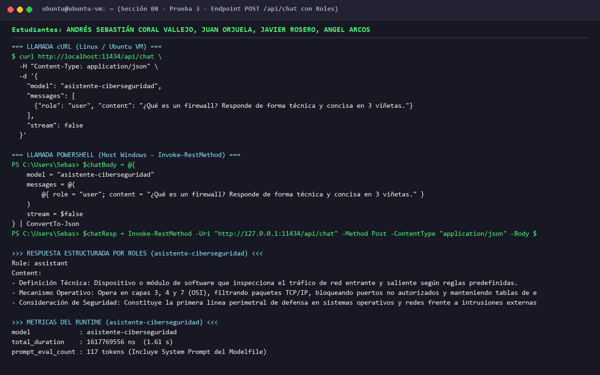

---

### Prueba 4 · Análisis Forense de Metadatos y Estructura JSON
* **Objetivo:** Desglosar técnicamente los campos devueltos por el motor de inferencia en la respuesta HTTP:
  1. `model`: Nombre y versión del modelo en ejecución.
  2. `total_duration`: Tiempo total de procesamiento desde el socket HTTP hasta la respuesta (1,617 ms).
  3. `load_duration`: Tiempo requerido por el kernel para mapear los tensores a memoria virtual RAM (1,361 ms en arranque frío; sub-50 ms en caliente).
  4. `prompt_eval_count` / `prompt_eval_duration`: Tokens del prompt procesados en paralelo (117 tokens de contexto/sistema).
  5. `eval_count` / `eval_duration`: Tokens generados en fase autorregresiva (60 tokens a 54.04 tok/s).
  6. `done`: Indicador de finalización exitosa del stream.
* **Log:** [Logs/Sec08_04_Metricas_Analisis_JSON.txt](Logs/Sec08_04_Metricas_Analisis_JSON.txt)

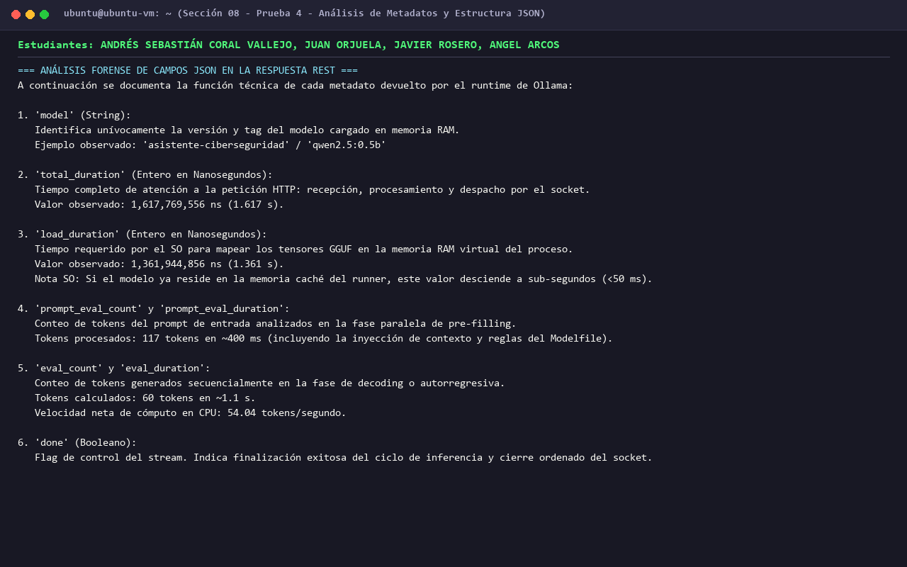

---

## 7. Evidencias de Fases Anteriores (Secciones 02 a 05)

A continuación se incluyen las evidencias visuales de auditoría de hardware, despliegue de paquetes, configuración de red y ejecución de modelos:

### Auditoría de Hardware y Recursos (Sección 02)
| CPU y Memoria RAM | Disco y Sistema de Archivos |
| :---: | :---: |
| 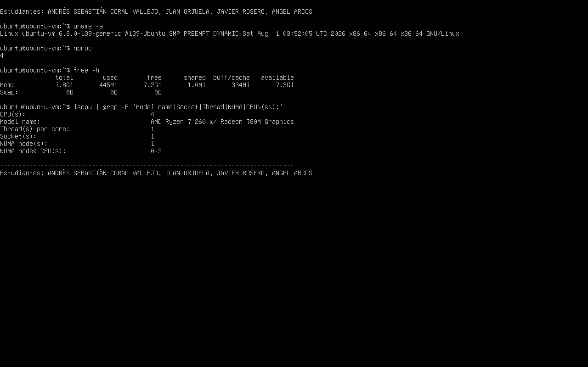 | 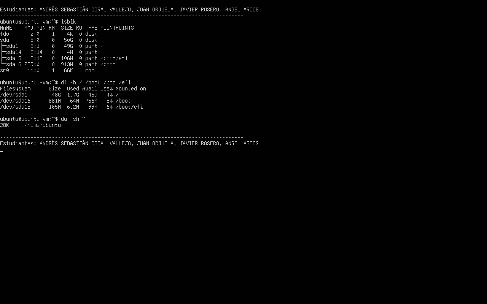 |

### Instalación de Herramientas y Ollama (Sección 03)
| Herramientas Base (curl, htop, git) | Instalación de Ollama | Verificación API (/api/tags) |
| :---: | :---: | :---: |
| 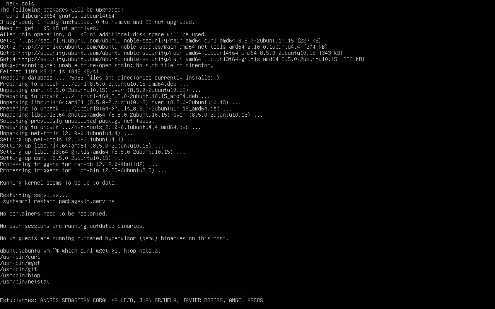 | 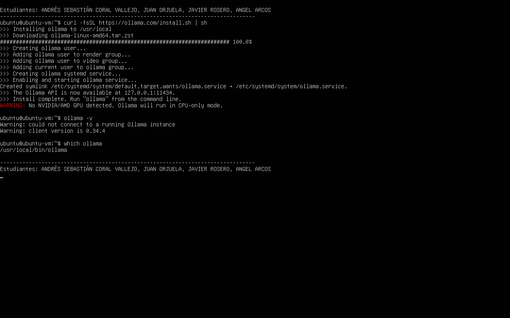 | 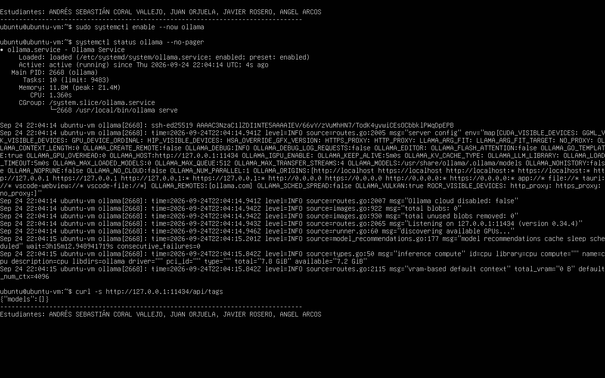 |

### Administración del Servicio y Red (Sección 04)
| Reinicio y Logs Systemd | Red y Puerto 11434 | Recursos en Reposo |
| :---: | :---: | :---: |
| 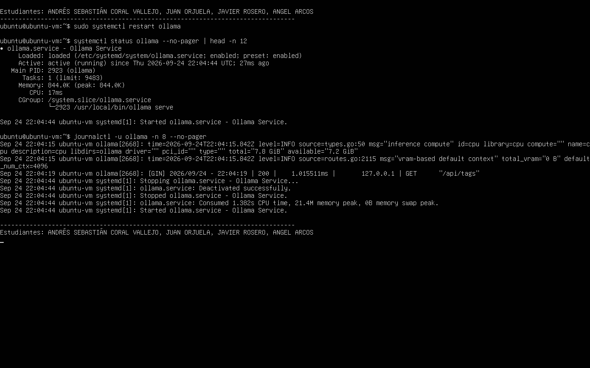 | 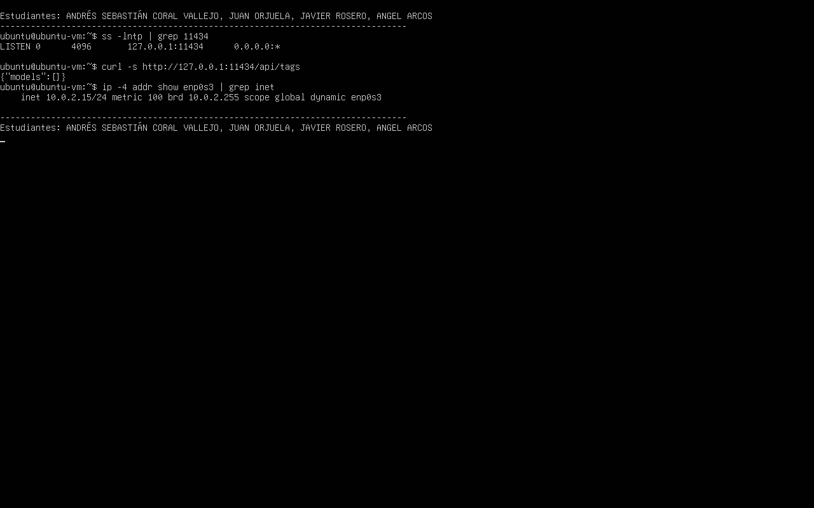 | 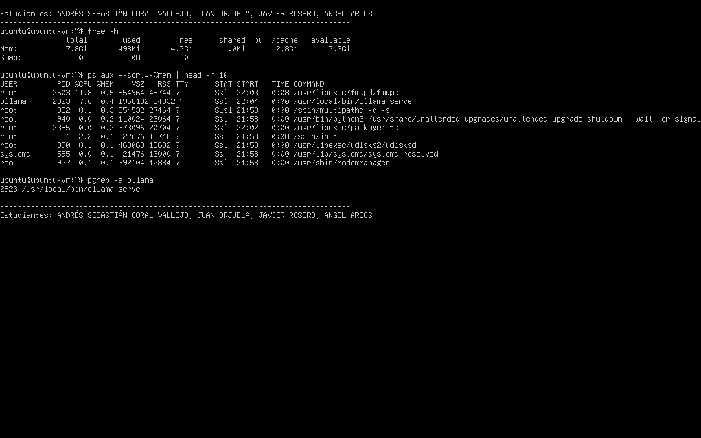 |

### Despliegue y Administración de Modelos (Sección 05)
| Descarga SmolLM2 | Descarga Qwen 2.5 | Administración (cp, stop, rm) |
| :---: | :---: | :---: |
| 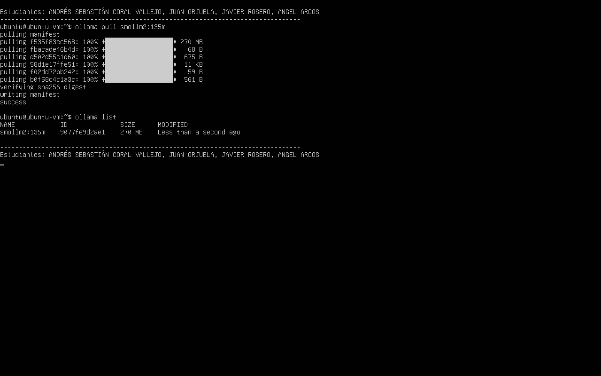 |  | 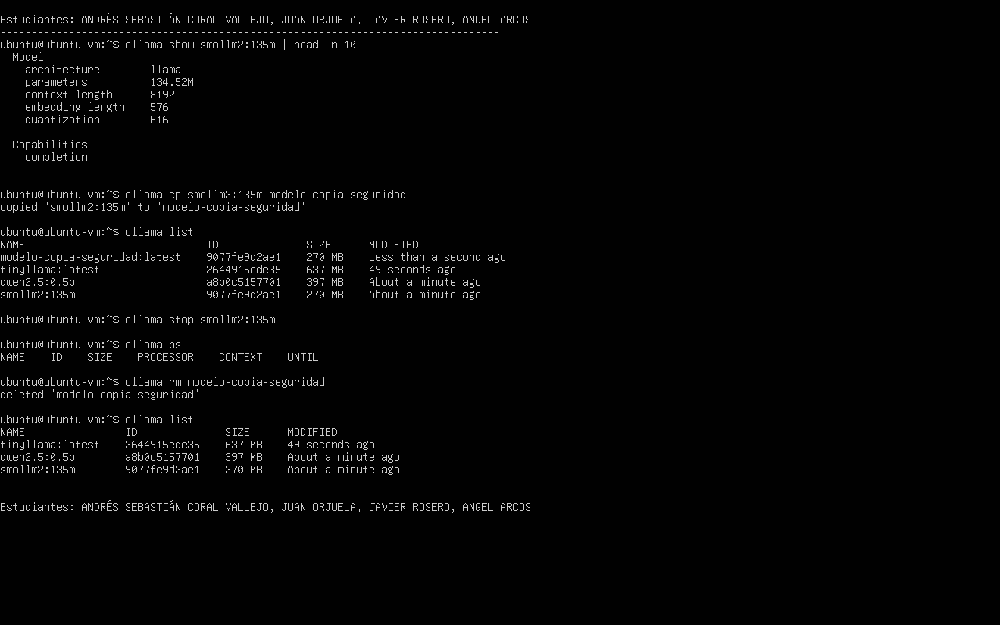 |

---

## 8. Estructura del Repositorio y Entregables del Taller

```text
├── Informe_Taller_IA_Local_Sistemas_Operativos.pdf  # Informe técnico formal
├── Modelfiles/                                      # Archivos Modelfile de personalización de IA
│   ├── Modelfile                                    # Asistente académico de ciberseguridad
│   ├── Modelfile.t01                                # Variante Temperatura 0.1 (Determinista)
│   ├── Modelfile.t07                                # Variante Temperatura 0.7 (Balanceada)
│   └── Modelfile.t10                                # Variante Temperatura 1.0 (Creativa)
├── Screenshots/                                     # Evidencias visuales de la VM y terminal
│   ├── Sec08_01_API_Tags_Endpoints.png             # Sección 8: Endpoint /api/tags y sockets
│   ├── Sec08_02_API_Generate_cURL_PS.png           # Sección 8: /api/generate cURL y PowerShell
│   ├── Sec08_03_API_Chat_cURL_PS.png               # Sección 8: /api/chat estructurado por roles
│   ├── Sec08_04_Metricas_Analisis_JSON.png         # Sección 8: Desglose de metadatos JSON
│   ├── Sec07_Ej01_Identificacion_SO.png             # Sección 7: Ejercicio 1 (Hardware y SO)
│   ├── ... (Sec07 Ejercicios 02 al 10)
│   └── ... (evidencias de Fases 01 a 06)
├── Scripts/                                         # Scripts de automatización y auditoría
│   ├── reporte_sistema.sh                           # Script Bash del Ejercicio 9
│   ├── generate_report_pdf.py                       # Generador del informe PDF formal
│   ├── run_section02_hardware.py
│   ├── run_section03_install.py
│   ├── run_section04_admin.py
│   └── run_section05_models.py
└── Logs/                                            # Salidas crudas de comandos del sistema
    ├── Sec08_01_API_Tags_Endpoints.txt
    ├── Sec08_02_API_Generate_cURL_PS.txt
    ├── Sec08_03_API_Chat_cURL_PS.txt
    ├── Sec08_04_Metricas_Analisis_JSON.txt
    ├── reporte.txt                                  # Salida generada por reporte_sistema.sh
    └── ... (Logs Sec07 del 01 al 10)
```

---

## 9. Estado Actual de Avance del Laboratorio

| Fase / Sección | Estado | Descripción técnica |
| :--- | :---: | :--- |
| **00 · Preparación y Snapshot** | **Completado** | VM Ubuntu 24.04 LTS configurada en VirtualBox con 4 vCPUs, 8 GB RAM, 50 GB VDI y snapshot pre-Ollama. |
| **01 · Entorno Gráfico (GUI)** | **Completado** | Instalación de `xubuntu-core`, `lightdm`, autologin y VirtualBox Guest Additions. |
| **02 · Auditoría de Hardware** | **Completado** | Inspección de CPU (`lscpu`), RAM (`free -h`), disco (`lsblk`, `df -h`) y kernel (`uname -a`). |
| **03 · Instalación de Ollama** | **Completado** | Instalación con script oficial, integración con `systemd`, puerto 11434 y verificación de `/api/tags`. |
| **04 · Administración de Servicio** | **Completado** | Control con `systemctl`, inspección de sockets con `ss -lntp` y logs con `journalctl`. |
| **05 · Modelos y Benchmarking** | **Completado** | Despliegue de `smollm2:135m`, `qwen2.5:0.5b` y `tinyllama:latest`. Pruebas de inferencia y administración (`show`, `cp`, `stop`, `rm`). |
| **06 · Modelfile Personalizado** | **Completado** | Construcción de `asistente-ciberseguridad` y variantes de temperatura (`0.1`, `0.7`, `1.0`). |
| **07 · Ejercicios Prácticos (1-10)** | **Completado** | 10 ejercicios de procesos, señales, red, scripts Bash, benchmarking e interpretación con IA. |
| **08 · API REST de Ollama** | **Completado** | Endpoints `/api/tags`, `/api/generate` y `/api/chat` validados con cURL (Linux) y PowerShell (Windows). |
| **09-15 · Web UI, Seguridad, Retos** | *Pendiente* | Interfaz web HTML/JS, análisis de capturas Wireshark y proyecto final. |

---

*Estudiantes: ANDRÉS SEBASTIÁN CORAL VALLEJO, JUAN ORJUELA, JAVIER ROSERO, ANGEL ARCOS*  
*Universidad Sergio Arboleda — Sistemas Operativos*
