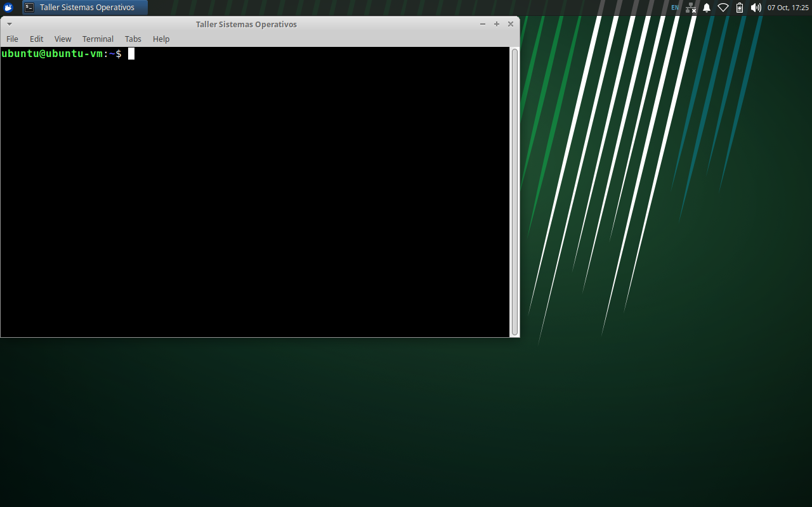

# Taller Ollama - IA local en una VM Ubuntu

Taller de Sistemas Operativos (Mg. Iván Darío Méndez Aguilera).

Integrantes: Angel Arcos, Sebastian Coral, Juan Orjuela, Javier Rosero

Instalamos Ollama en una máquina virtual Ubuntu 24.04 (VirtualBox), resolvimos los ejercicios de la guía
y armamos un asistente de ciberseguridad que corre local (AsistenteIA-VM).

## Parte 1 · Taller IA nube e IA local

### 1. Definición de Inteligencia Artificial (IA)

Una **Inteligencia Artificial (IA)** es un software diseñado para procesar información y resolver tareas que históricamente requerían intervención humana, como la comprensión del lenguaje natural, el razonamiento lógico, el reconocimiento de patrones y la toma de decisiones basada en datos.

A diferencia del software convencional, donde el programador establece manualmente reglas mediante sentencias condicionales (`if/else`), una IA moderna opera mediante **Machine Learning** y redes neuronales (*Deep Learning*). En lugar de seguir una lógica rígida preprogramada, el sistema identifica patrones a partir del análisis estadístico de grandes volúmenes de datos, ajustando sus pesos matemáticos para resolver consultas de manera autónoma.

En el caso específico de los **modelos de lenguaje locales (LLMs)**, la IA es una red neuronal preentrenada que almacena parámetros ponderados (pesos matemáticos). Al recibir una instrucción de entrada (*prompt*), el sistema evalúa la secuencia previa y calcula de forma probabilística y matricial cuál es el siguiente token más probable, construyendo una respuesta estructurada y coherente.

---

### 2. Comparativa: IA Local vs. IA en la Nube

El despliegue de soluciones de inteligencia artificial varía significativamente según el entorno de ejecución, especialmente cuando se aísla en una **Máquina Virtual (VM)**:

| Criterio | IA en la Nube | IA Local en Máquina Virtual (*VM*) |
| :--- | :--- | :--- |
| **Entorno de ejecución** | Servidores externos y granjas de cómputo distribuidas (OpenAI, Google, AWS). | Entorno virtualizado y aislado (*sandbox*) dentro del equipo del usuario. |
| **Privacidad y confidencialidad** | Las consultas viajan por la red y dependen de políticas del proveedor. | **Privacidad total**: Ningún dato sale de la máquina virtual ni de la red local. |
| **Dependencia de red** | Requiere conexión continua y estable a internet. | **Operación autónoma y fuera de línea (*offline*)**. |
| **Capacidad de cómputo** | Escalable con modelos de cientos de miles de millones de parámetros. | **Acotada al hardware asignado**: Comparte vCPUs y memoria RAM física. |
| **Costos operativos** | Tarificación recurrente por token o suscripciones mensuales. | **Costo cero por consulta**, requiriendo únicamente la descarga inicial de los pesos. |

---

### 3. Cinco Modelos de IA Viables para Hardware Virtualizado

En un entorno virtualizado configurado entre 6 GB y 8 GB de RAM asignada, se priorizan modelos compactos:

#### 1. SmolLM2 (135M / 360M) — Hugging Face
* **Consumo de memoria estimado:** ~270 MB a 400 MB de RAM.
* **Propósito:** Ultraligero, diseñado para inferencia de altísima velocidad en CPU (>60 tokens/s). Ideal para clasificación rápida, generación concisa y automatización liviana.

#### 2. Qwen 2.5 (0.5B) — Alibaba Cloud
* **Consumo de memoria estimado:** ~397 MB de RAM.
* **Propósito:** Excelente equilibrio entre fluidez de generación (>50 tokens/s) y seguimiento riguroso de instrucciones. Es el modelo base recomendado para entornos educativos y VMs.

#### 3. Llama 3.2 (1B / 3B) — Meta
* **Consumo de memoria estimado:** ~1.3 GB (1B) a ~2.8 GB (3B) de RAM.
* **Propósito:** Modelo versátil para redacción, síntesis documental, traducción y asistencia conversacional estructurada.

#### 4. Phi-3.5 Mini (3.8B) — Microsoft
* **Consumo de memoria estimado:** ~3.2 GB de RAM.
* **Propósito:** Destacado en razonamiento lógico, análisis matemático y seguimiento de instrucciones complejas paso a paso.

#### 5. Asistente Especializado en Ciberseguridad (Modelfile Customizado)
* **Consumo de memoria estimado:** ~400 MB de RAM.
* **Propósito:** Creado a partir de `qwen2.5:0.5b` mediante un `Modelfile` del taller con rol estricto de auditor de seguridad en sistemas operativos Linux, proporcionando análisis forense y hardening sin salirse de su dominio.

---

### 4. Tipos de IA Local y Viabilidad en el Hardware del Taller

#### Especificaciones del Entorno Virtualizado (VirtualBox)
* **Sistema Operativo Huésped:** Ubuntu 24.04.5 LTS (Noble Numbat) x86_64, Kernel `6.8.0-45-generic`.
* **Procesador Anfitrión:** Intel Core i5-12450H / Core i9 (4 vCPUs dedicadas).
* **Memoria RAM Asignada:** 8.0 GiB (7.8 GiB utilizables).
* **Almacenamiento Virtual:** 50 GB VDI dinámico en `/dev/sda2` (formato ext4).
* **Red:** Interfaz NAT con reenvío de puertos `2222 -> 22` (SSH) y `11434 -> 11434` (Ollama REST API).
* **Entorno Gráfico:** XFCE Desktop (`xubuntu-core`) + LightDM autologin + VirtualBox Guest Additions.

#### Entorno Gráfico del Sistema Operativo en Vivo


#### Matriz de Viabilidad Técnica

| Categoría de IA Local | Viabilidad | Diagnóstico y Consideraciones de Sistemas Operativos |
| :--- | :---: | :--- |
| **Modelos Sub-1B (135M a 500M)** | **Óptima** | Tasa superior a 50-70 tokens/s en CPU pura. Latencias de inicio menores a 2 segundos. |
| **Modelos 1B a 3B** | **Viable** | Generación fluida (15-35 tokens/s). Adecuado para interacción conversacional. |
| **Modelos 7B a 8B (Q4)** | **Límite operativo** | Requiere ~5.5 GB de RAM. En CPU puede presentar latencias elevadas (>15 s). |
| **Modelos >14B o no cuantizados** | **No viable** | Exceden la RAM disponible y provocan la activación del *OOM Killer* del kernel Linux. |
| **Modelos de Difusión de Imágenes** | **No recomendado** | Inviable en CPU sin GPU dedicada debido a tiempos de cómputo inaceptables. |

---

## Parte 2 · Taller Ollama en una VM Ubuntu

### Contenido

- `Informe_Taller_Ollama_VM.pdf`: el informe. Empieza con la parte teórica (qué es la IA, IA local frente a la nube, modelos viables y tipos de IA local) y después sigue cada punto de la guía con sus salidas y capturas de la VM.
- `codigo/AsistenteIA-VM/`: la interfaz web (index.html), el Modelfile del asistente y `servir.sh`.
- `codigo/scripts/`: un script por ejercicio (e01 a e10, s02 a s12), el benchmark (`bench.py`), el experimento de temperatura, la prueba de la API desde PowerShell (`s08_powershell.ps1`) y los scripts de las capturas.
- `codigo/reporte_sistema.sh`: script del ejercicio 9.

Las salidas de terminal y las capturas empiezan con:

```
cloud@ubuntu-ollama:~$ echo "Angel Arcos - Sebastian Coral - Juan Orjuela - Javier Rosero"
```

### Cómo correrlo en la VM

```bash
curl -fsSL https://ollama.com/install.sh | sh
ollama pull llama3.2:3b
cd codigo/AsistenteIA-VM
ollama create asistente-ciberseguridad -f Modelfile
./servir.sh        # y abrir http://localhost:8080 en Firefox dentro de la VM
```

Los scripts de `codigo/scripts/` esperan estar en `~/taller-ollama`; `bash codigo/rehacer.sh` los corre todos en orden.

### Notas

- VM: 4 vCPU, 6 GB de RAM, 40 GB de disco, sin GPU (Ollama corre en CPU).
- En nuestro equipo VirtualBox corre encima de Hyper-V y la VM se congelaba con 4 hilos de inferencia.
  Lo arreglamos limitando Ollama a 3 CPU con un override de systemd (`AllowedCPUs=0-2`) y `num_thread 3`. Está explicado en la sección 3.1 del informe.
- Ollama y la interfaz solo escuchan en 127.0.0.1, no quedan expuestos a la red.

La primera versión de este repositorio (secciones 02 a 08, hecha en otra VM) quedó guardada en la etiqueta `version-inicial-sebastian`.
